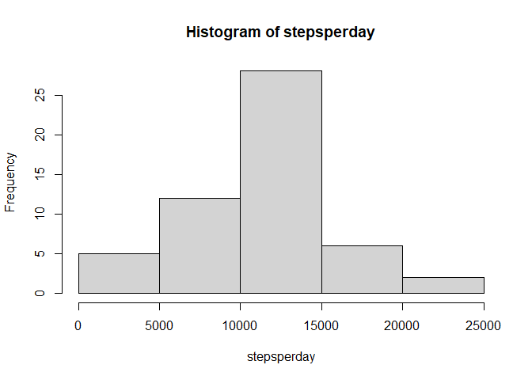
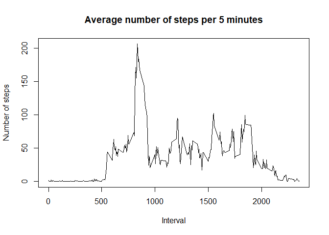
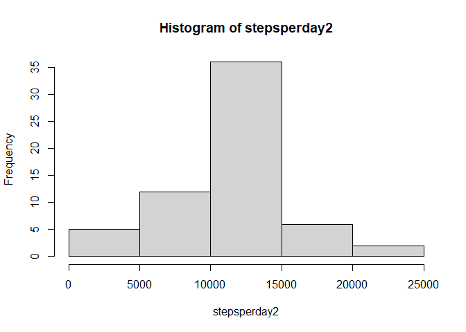
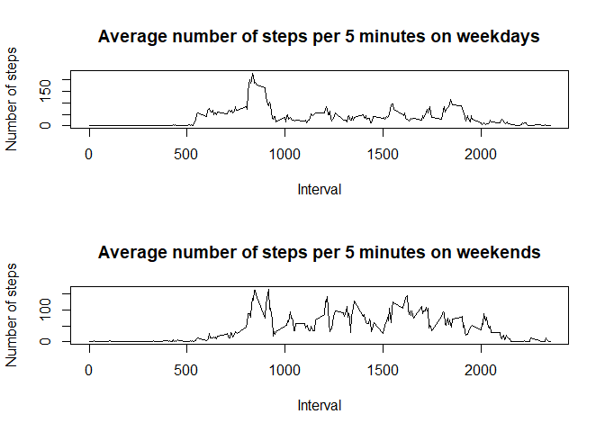

## Loading and preprocessing the data


```r
# Reading data
activity <- read.csv("activity.csv")

# Turning dates into Date class
activity$date <- as.Date(activity$date)
```


## What is the mean total number of steps taken per day?

```r
# Calculating steps per day
stepsperday <- tapply(activity$steps, activity$date, sum)

# Making histogram of steps per day
hist(stepsperday)
```

<!-- -->

```r
# Calculating mean and median steps per day
meanstepsperday <- mean(stepsperday, na.rm = TRUE)
print(paste("Mean steps per day:", round(meanstepsperday, digits=2)))
```

```
## [1] "Mean steps per day: 10766.19"
```

```r
medianstepsperday <- median(stepsperday, na.rm = TRUE)
print(paste("Median steps per day:", medianstepsperday))
```

```
## [1] "Median steps per day: 10765"
```

## What is the average daily activity pattern?

```r
# Calculating average steps per 5 minute increment over all days
stepsovertime <- tapply(activity$steps, activity$interval, mean, na.rm = TRUE)

# Making plot of steps per 5 minute increment
# Why does this dataset have 2400 minutes per day??
plot(unique(activity$interval), stepsovertime, type="l",
     main="Average number of steps per 5 minutes" , xlab="Interval", ylab="Number of steps")
```

<!-- -->

```r
# Determine interval with highest average number of steps
mostactiveinterval <- names(stepsovertime[stepsovertime == max(stepsovertime)])
print(paste("Interval with most average steps:", mostactiveinterval))
```

```
## [1] "Interval with most average steps: 835"
```

## Imputing missing values

```r
# Determining number of missing values
missingvalues <- sum(is.na(activity$steps))
print(paste("Number of missing values in steps column:", missingvalues))
```

```
## [1] "Number of missing values in steps column: 2304"
```

```r
# Making new dataset version
activity2 <- activity

# Filling in missing values with mean for that interval
for(i in 1:length(rownames(activity2))){
  if(is.na(activity2$steps[i])){
    activity2$steps[i] <- stepsovertime[activity2$interval[i] == names(stepsovertime)]
  }
}

# Calculating steps per day
stepsperday2 <- tapply(activity2$steps, activity2$date, sum)

# Making histogram of steps per day
hist(stepsperday2)
```

<!-- -->

```r
# Calculating mean and median steps per day
meanstepsperday2 <- mean(stepsperday2, na.rm = TRUE)
print(paste("Mean steps per day:", round(meanstepsperday2, digits=2)))
```

```
## [1] "Mean steps per day: 10766.19"
```

```r
medianstepsperday2 <- median(stepsperday2, na.rm = TRUE)
print(paste("Median steps per day:", medianstepsperday2))
```

```
## [1] "Median steps per day: 10766.1886792453"
```

## Are there differences in activity patterns between weekdays and weekends?

```r
# Making new dataset version
activity3 <- activity2

# Marking rows as weekday or weekend
activity3$day <- weekdays(activity3$date)
for(i in 1:length(rownames(activity3))){
  if(activity3$day[i] %in% c("Saturday", "Sunday")){
    activity3$day[i] <- "weekend"
  }
  else{
    activity3$day[i] <- "weekday"
  }
}
activity3$day <- as.factor(activity3$day)

# Calculating average steps per 5 minute increment over weekdays and weekends
stepsovertimeweekdays <- tapply(activity3[activity3$day=="weekday","steps"],
                                activity3[activity3$day=="weekday","interval"], mean, na.rm = TRUE)
stepsovertimeweekends <- tapply(activity3[activity3$day=="weekend","steps"],
                                activity3[activity3$day=="weekend","interval"], mean, na.rm = TRUE)

# Making plot of steps per 5 minute increment
par(mfrow=c(2,1))
plot(unique(activity3$interval), stepsovertimeweekdays, type="l",
     main="Average number of steps per 5 minutes on weekdays", xlab="Interval", ylab="Number of steps")
plot(unique(activity3$interval), stepsovertimeweekends, type="l",
     main="Average number of steps per 5 minutes on weekends", xlab="Interval", ylab="Number of steps")
```

<!-- -->
